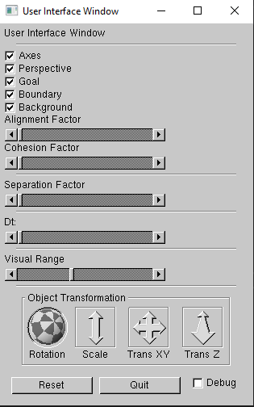

# OpenGL Boids Simulation
An OpenGL boid (bird-oid) simulation project written in C++.

This project simulates the behavior of bird like objects as outlined by [Craig Reynolds](http://www.red3d.com/cwr/).
My program follows the three main rules of the boid algorithm:

1. Separation: Avoid collsion with local boids.
2. Alignment: Move towards the average vector of the flock.
3. Cohesion: Move towards the average position of the flock.

In addition to the three main rules that describe the boid algorithm I have also added a goal rule that will attract all the boids to the goal position. After reaching the goal postion the boids will osciliate around the goal.

Certain simulation parameters are made editable so that the user can create countless unique boid flocks. Below is a screenshot of the window that users can use to edit parameters like the alignment, cohesion, separation factors as well as the time step (to slow or speed up the program) and the visual range of each boid (increasing or decreasing this variable will result in bigger or smaller flocks respectively).

The boid code can be found in boid.cpp and the code that calls and aggregates the boid rules can be found in sample.cpp from lines 1849-1892 in the UpdateBoids function.

